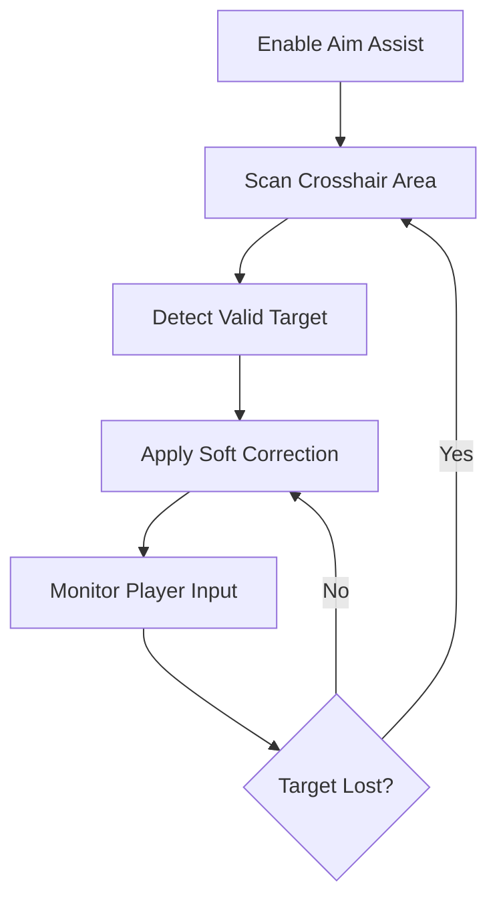

# Fortnite Aim Assist

In the electric storm of the island, where builds rise like sudden thoughts and gunfire cracks the sky, aim becomes destiny. The **Fortnite Aim Assist** tool exists for that fragile moment between intention and impact — when your crosshair hesitates, and victory waits.

This software is crafted as a **precision enhancement tool** for PC players seeking consistency, stability, and refined control inside **Fortnite**. It doesn’t steal the fight from you — it steadies your hand and lets your decisions shine.

---

## 🎯 Overview — A Gentle Hand on the Crosshair

Unlike aggressive lock-on systems, this Aim Assist focuses on **micro-adjustments**:

* Smooth target tracking
* Controlled aim correction
* Reduced overflick and jitter
* Natural-looking movement patterns

The result feels less like automation and more like clarity — as if your aim finally listens to your thoughts.

[!NOTE]
The philosophy here is subtlety. Precision should whisper, not shout.

---

## ⚡ Core Features — Where Accuracy Breathes

### 👁 Smart Target Tracking

The assist adapts in real time:

* Prioritizes visible enemies
* Adjusts strength by distance
* Reacts to movement speed

Perfect for mid-range AR duels and close-quarter SMG fights.

### 🔫 Recoil & Spread Control

Weapons behave more predictably:

* Vertical recoil smoothing
* Horizontal spread stabilization
* Configurable weapon profiles

Each shot feels intentional, not chaotic.

### 🧠 Humanized Aim Logic

No robotic snapping:

* Soft magnetism near hitboxes
* Gradual crosshair pull
* Adjustable reaction delay

Your gameplay remains believable — even under watchful eyes.

### 🎛 Full Configuration Panel

Fine-tune everything:

* Aim strength sliders
* FOV targeting radius
* Toggle keys for combat situations

Control belongs to you, always.

---

## 🚀 Setup — Calm Before the Drop

Getting started is quick, almost ceremonial:

1. Launch Fortnite and reach the lobby
2. Start the Aim Assist tool as administrator
3. Choose your preferred aim profile
4. Enter a match and toggle assist when needed

```text
Recommended DPI: 800
In-game sensitivity: Medium-Low
Suggested FOV assist radius: 6–10°
```

[!IMPORTANT]
Begin with low assist strength and increase gradually to maintain natural movement.

---

## 🧭 Aim Assist Logic Flow



A quiet loop, endlessly attentive — correcting without commanding.

---

## ❓ FAQ — Questions from the Island

**Is this an aimbot?**
No. It enhances aim control without full lock-on behavior.

**Can I adjust strength mid-game?**
Yes, hotkeys allow instant tuning or disabling.

**Does it work in Zero Build mode?**
Absolutely — especially effective during movement-heavy gunfights.

**Will it affect my FPS?**
Impact is minimal, even on mid-range systems.

**Is it usable for different weapons?**
Profiles can be customized per weapon class.

---

## 🌌 Final Thoughts — Precision Is a Feeling

Aim is not just mechanics — it’s confidence. When your crosshair rests where your eyes already are, the game feels quieter, slower, kinder. The **Fortnite Aim Assist** tool exists to restore that feeling.

Not domination.
Not chaos.
Just control — steady as breath before the shot.

---
